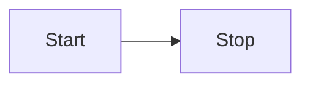

```ahk
#Requires AutoHotkey v2.0

; ~ 表示发送指令前还需执行一次原来按键的功能
~^[::
{
	Send "{Esc}"
}


;; google chrome emacs-like setting
;; ^ - Ctrl
;; ! - Alt
;#HotIf WinActive("ahk_exe Chrome.exe") or WinActive("ahk_exe Obsidian.exe") or WinActive("ahk_exe idea64.exe") or WinActive("ahk_exe Notepad.exe") or WinActive("ahk_exe Code.exe")
;{
	^n::Send "{Down}"
	^p::Send "{Up}"
	^f::Send "{Right}"
	^b::Send "{Left}"
	!b::Send "^{Left}"
	!f::Send "^{Right}"
	!e::Send "{End}"
	!a::Send "{Home}"
	^k::kill_line()
	^@::Send "+{Right}"
	;^DEL::kill_word()
;}

kill_line()
{
  Send "{ShiftDown}{END}{SHIFTUP}"
  ;; Sleep 50 ;[ms] this value depends on your environment
  Send "{BACKSPACE}"
  Return
}

kill_word()
{
  Send "!f{BACKSPACE}"
  Return
}
```

[[Obsidian Vim 自动切换搜狗输入法中英状态]]

