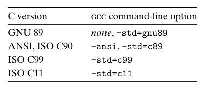
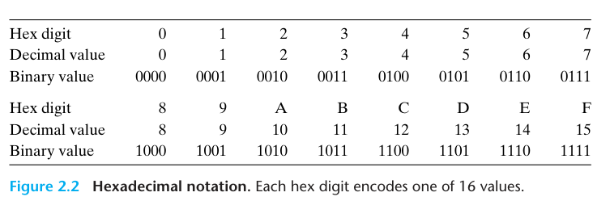

## 2.1 Information Storage

Most computers use block of 8 bits, or *bytes*, as the smallest unit of memory.

A mechine-level program views memory as a very large array of bytes, referred to as *virtual memory*. Every byte of memory is identified by a unique nubmer, known as *address*, and the set of all possible addresses is known as the *virtual address space*.

Virtual address space is just a conceptual image presented to mechine-level program. The actual implementation uses a combination of DRAM, flash memory, disk storage,special hardware, and operating system software to provide the program with what apears to be a monolithic byte array.

The GNU Compiler Collection (GCC) can compile programs according to the conventions of several different version of the C language, based on different command-line options.

Decimal and binary values associated with the hexadecimal digits:

practice problem 2.1:
A. 0x25B9D2 to binary
B. binary 1010111001001001 to hexadecimal
C. 0xA8B3D to binary
D. binary 1100100010110110010110 to hexadecimal

For $x = 2,048 = 2^{11}$, we have $n = 11 = 3 + 4 \cdot 2$, giving hexdecimal representation `0x800`.

